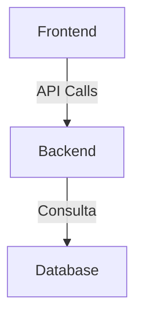

# Arquitetura

## Visão de alto nível
<!-- Descreva componentes principais e como se comunicam. Se possível, inclua um diagrama Mermaid.
Ex:

-->

## Estrutura de pastas do código-fonte
<!-- Explique a organização de diretórios do projeto real (não deste template).
Ex:
- `src/` - Código-fonte
  - `components/` - Componentes reutilizáveis
  - `pages/` - Páginas principais
  - `services/` - Lógica de negócios e APIs
-->

## Fluxos críticos
<!-- Ex: fluxo de autenticação, fluxo de pagamento, pipeline de dados.
Ex:
1. **Autenticação**: Usuário faz login → Frontend envia credenciais para `/auth/login` → Backend valida e retorna token JWT.
-->

## Restrições técnicas conhecidas
<!-- Limitações de performance, escala, compatibilidade que a IA deve respeitar.
Ex:
- "O backend deve suportar até 1000 requisições por segundo no plano gratuito."
-->